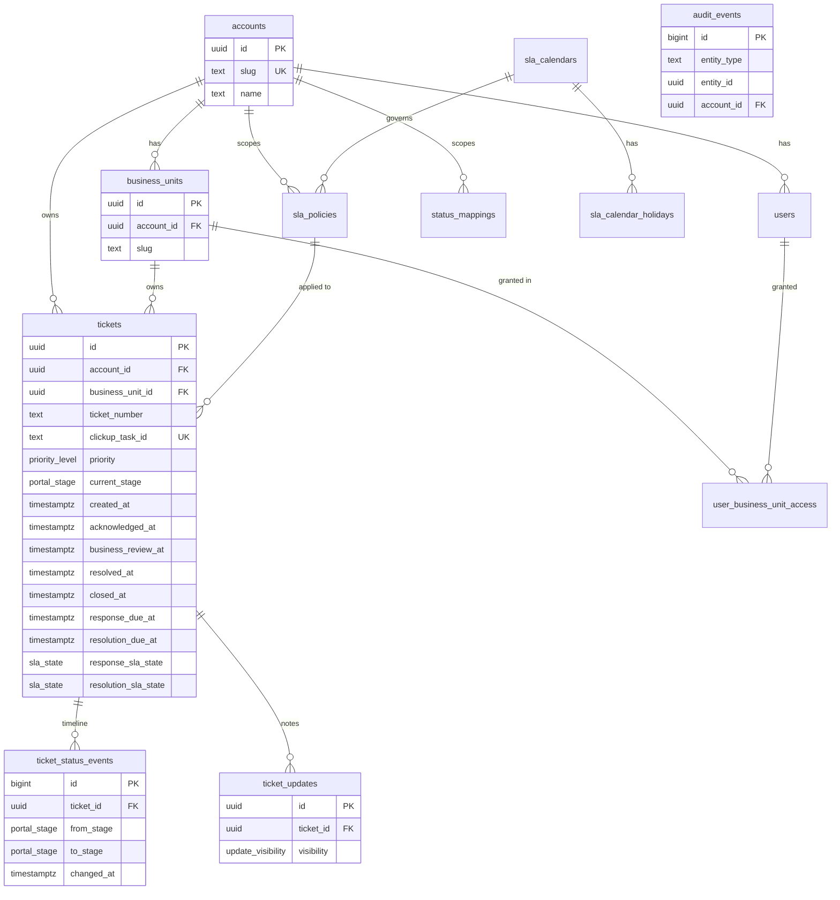

# Pattern Support Portal — Data Model (V1)

**Status:** Design — schema verified against PostgreSQL (applies cleanly: 13 tables, all constraints, 37 indexes).
**Scope:** Complete system data model only. No UI, no API, no architecture beyond what the data layer requires.
**Database:** PostgreSQL (Azure Database for PostgreSQL — Flexible Server).
**Companion file:** `schema.sql` (executable DDL).

---

## 1. Entity Relationship Model

### 1.1 Design principles

The model is built around five concerns the brief calls out: **multi-account tenancy**, **ticket lifecycle**, **SLA (response + resolution)**, **full status history**, and **auditability** — with **reporting/analytics** treated as a derived read concern rather than a separate store.

A few decisions shape everything below:

1. **The database is the portal's only source of truth at request time.** The sync service writes; the portal only reads. Nothing in the customer request path touches ClickUp. This is why the model stores *snapshots* (milestone timestamps, SLA state) alongside the *canonical events* they are derived from — reads must be fast and must not depend on recomputation.

2. **Internal taxonomy is never exposed.** ClickUp statuses are operator-configurable free text. We map them onto a fixed, customer-facing `portal_stage` enum via a `status_mappings` table. The portal queries `portal_stage`; it never shows raw ClickUp status names. Comments default to *hidden* and must be explicitly marked public.

3. **Tenancy is a first-class column, not a join.** Every customer-facing row (`tickets`, `ticket_status_events` via parent, `ticket_updates` via parent) resolves to an `account_id`. This enables PostgreSQL Row-Level Security (RLS) as defence-in-depth on top of application filtering.

4. **Stored vs derived is explicit.** Canonical inputs are immutable history; everything a dashboard needs fast is a denormalised snapshot the sync service maintains and can always rebuild from history.

### 1.2 Entities

| Entity | Role | Key relationships |
|---|---|---|
| `accounts` | Enterprise customer / tenant root (e.g. **Pepkor**) | 1 → many `business_units`, `users`, `tickets` |
| `business_units` | Trading entity under an account (Tekkie Town, DUNNS, CODE, Refinery, Ayana, SPCC) | many → 1 `accounts`; 1 → many `tickets` |
| `users` | Portal user, authenticated via Entra ID | many → 1 `accounts` (NULL for internal staff) |
| `user_business_unit_access` | Per-BU grant for `BU_VIEWER` users | join: `users` ↔ `business_units` |
| `sla_calendars` | Business-hours + timezone the SLA clock runs against | 1 → many `sla_policies`, `sla_calendar_holidays` |
| `sla_calendar_holidays` | Non-working days for a calendar | many → 1 `sla_calendars` |
| `sla_policies` | Response/resolution targets per priority, scoped to account/BU/global | references `sla_calendars`; applied to `tickets` |
| `status_mappings` | Maps raw ClickUp status → `portal_stage` (+ SLA-pause flag) | scoped optionally by `accounts` |
| `tickets` | Core entity: one customer-visible support item | many → 1 `accounts`, `business_units`; references applied `sla_policies` |
| `ticket_status_events` | **Canonical** append-only lifecycle timeline | many → 1 `tickets` |
| `ticket_updates` | Customer-facing progress notes (public/internal) | many → 1 `tickets` |
| `audit_events` | Append-only record of every change (any entity) | references `accounts`, `users` |
| `sync_runs` | Observability for the sync service | standalone |

### 1.3 ER diagram

---

## 2. Lifecycle & SLA modelling

### 2.1 Lifecycle stages

The customer-facing lifecycle is a fixed enum (`portal_stage`):

`NEW → ACKNOWLEDGED → IN_PROGRESS → (ON_HOLD) → (BUSINESS_REVIEW) → RESOLVED → CLOSED`, with `REOPENED` re-entering the flow.

- **ACKNOWLEDGED** is the **response** milestone (drives response SLA).
- **BUSINESS_REVIEW** models the handover/sign-off state the brief requires.
- **ON_HOLD** is where the SLA clock typically pauses (waiting on customer/third party).
- **RESOLVED** is the **resolution** milestone (drives resolution SLA); **CLOSED** is terminal.

Each raw ClickUp status is mapped to one of these in `status_mappings`, with an `is_sla_paused` flag so pause behaviour is configuration, not code.

### 2.2 SLA model

`sla_policies` define `response_target_minutes` and `resolution_target_minutes` per `priority_level`, scoped from most-specific to least: **business unit → account → global default** (NULLs widen scope). Each policy optionally references an `sla_calendars` row (business hours + timezone, default `Africa/Johannesburg`) plus `sla_calendar_holidays`; a NULL calendar means 24×7 wall-clock.

The sync service evaluates SLA on every sync and writes a snapshot onto the ticket: `response_due_at`, `resolution_due_at`, `response_sla_state`, `resolution_sla_state`, and accumulated `sla_paused_ms`. `at_risk_threshold_pct` (default 80%) drives the `AT_RISK` state for early-warning dashboards.

---

## 3. Stored vs Derived

This is the most important modelling decision, so it is explicit:

| Data | Classification | Where | Why |
|---|---|---|---|
| Raw synced fields (title, description, priority, raw status, requester) | **Stored, canonical** | `tickets` | Mirror of source; idempotent on `clickup_task_id` + `content_hash` |
| Every status transition | **Stored, canonical (immutable)** | `ticket_status_events` | Source of truth for the timeline; everything else can be rebuilt from it |
| Status mappings, SLA policies, calendars | **Stored, canonical config** | config tables | Operator-controlled inputs |
| Milestone timestamps (`acknowledged_at`, `business_review_at`, `resolved_at`, `closed_at`) | **Derived → stored snapshot** | `tickets` | Denormalised from events for fast dashboard/detail reads without aggregation |
| SLA due times + SLA state | **Derived → stored snapshot** | `tickets` | Recomputed by sync; storing makes reads O(1) and keeps history stable when a policy changes later |
| Time-in-status, MTTR, breach rates, trends | **Derived, on demand** | reporting views / materialized views (Phase 4) | Computed from `ticket_status_events`; no need to store in V1 |

**Rule of thumb:** if it can change retroactively when configuration changes, store the snapshot *and* keep the inputs. Never store something you cannot rebuild from canonical history.

---

## 4. Keys & integrity

- **Primary keys:** UUID surrogate keys (`gen_random_uuid()`) on all domain tables to avoid enumerable IDs in URLs/APIs; `BIGINT` identity on high-volume append-only logs (`ticket_status_events`, `audit_events`, `sync_runs`).
- **Natural/business keys:** `accounts.slug`, `business_units (account_id, slug)`, `tickets.clickup_task_id` (idempotency), `tickets (account_id, ticket_number)` (display), `users.entra_object_id`.
- **Foreign keys:** `ON DELETE RESTRICT` for tenancy spines (you cannot delete an account/BU with live tickets); `ON DELETE CASCADE` for owned children (status events, updates, access grants); `ON DELETE SET NULL` for soft references (audit actor, applied policy).
- **Check constraints:** role/account coherence on `users`; milestone ordering on `tickets`; positive SLA targets; SLA-policy scope coherence.
- **Cross-column integrity** (ticket's BU must belong to its account) is enforced by an application/trigger guard, noted in the DDL — PostgreSQL has no native composite FK across a derived column.

---

## 5. Indexing strategy

Indexes are shaped to the portal's real read patterns, not added speculatively:

- **BU dashboard (most common):** partial index `(business_unit_id, created_at DESC) WHERE deleted_at IS NULL`.
- **Account-wide dashboard:** `(account_id, current_stage, created_at DESC)` partial on live rows.
- **SLA monitoring:** partial index on `resolution_due_at WHERE state IN (PENDING, AT_RISK)` — keeps the index tiny and hot for breach-warning queries.
- **Search:** trigram GIN on `title` and `ticket_number` for fuzzy/partial search.
- **Timeline & detail:** `(ticket_id, changed_at)` on events; partial `WHERE visibility = 'PUBLIC'` on updates so the portal index only contains customer-visible rows.
- **Sync/reconciliation:** `last_synced_at`.
- **Audit:** `(entity_type, entity_id, occurred_at DESC)` and `(account_id, occurred_at DESC)`.
- **Config resolution:** scoped indexes on `sla_policies` and `status_mappings`.

Partial indexes (`WHERE deleted_at IS NULL`, `WHERE visibility = 'PUBLIC'`) are used deliberately: they keep the hot indexes small and align the index exactly with how the portal filters.

---

## 6. Assumptions

1. **Account → BU is the tenancy hierarchy.** Pepkor is an `account`; Tekkie Town/DUNNS/CODE/Refinery/Ayana/SPCC are its `business_units`. Multiple accounts (other enterprise clients) are supported by the same model.
2. **One ClickUp task = one ticket.** `clickup_task_id` is the idempotency key.
3. **BU attribution exists in ClickUp** via a List/Folder or custom field that the sync service can read deterministically. (See risk R2.)
4. **Customers are read-only.** No table supports customer writes; `INTERNAL_STAFF` and the sync service are the only writers.
5. **All times stored UTC**, displayed in `Africa/Johannesburg` by the app.
6. **Comments are hidden by default** (`visibility` defaults to `INTERNAL`) — fail-safe against leaking internal notes.
7. Contrib extensions (`pgcrypto`, `citext`, `pg_trgm`, `btree_gin`) are available — they are standard on Azure Database for PostgreSQL.

## 7. Risks & open questions

| # | Risk / question | Impact | Recommendation |
|---|---|---|---|
| R1 | **SLA pause/business-hours semantics** need product sign-off (which stages pause? whole-day holidays? per-priority calendars?) | Wrong SLA numbers shown to enterprise clients | Confirm rules before Phase 4; model already supports pause flag + calendars |
| R2 | **BU attribution from ClickUp** may be inconsistent (free-text field, wrong list) | Tickets land under wrong tenant — a data-leak class issue | Require a structured ClickUp custom field; reject/quarantine unmapped tickets rather than guess |
| R3 | **Status taxonomy drift** — new ClickUp statuses appear unmapped | Tickets show wrong/blank stage | Sync must flag unmapped statuses and alert; never default-expose |
| R4 | **Reopened tickets** create multiple SLA cycles | Single snapshot loses earlier cycle metrics | V1 keeps current-cycle snapshot + full event history; add `ticket_sla_cycles` child table in Phase 4 if per-cycle reporting is needed |
| R5 | **PII & data residency** — requester names/emails are personal data | POPIA/compliance | Pin Azure region (e.g. South Africa North); restrict `requester_*` exposure via RLS/role; consider field-level encryption |
| R6 | **Hard deletes in ClickUp** | Tickets vanish from portal unexpectedly | Soft-delete (`deleted_at`) + retention policy rather than physical delete |
| R7 | **`audit_events` growth** | Table bloat over years | Monthly partitioning + archival in a later phase |

---

## 8. What this does *not* cover yet (deliberately)

API design, sync-service architecture, RLS policy DDL, auth/session flow, and UI are out of scope for this iteration per the working agreement. The model is intentionally lean for V1 (per "prefer simplicity over over-engineering"); `ticket_sla_cycles`, `ticket_attachments`, `contacts`, and reporting materialized views are identified as the natural Phase 4 extensions.
